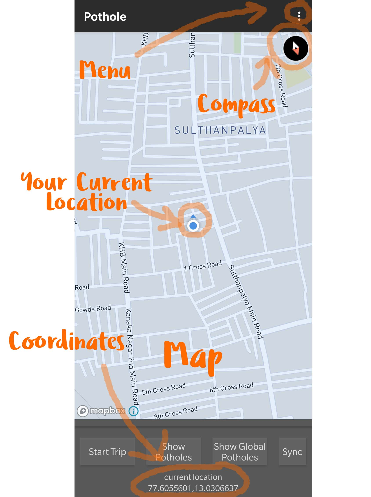
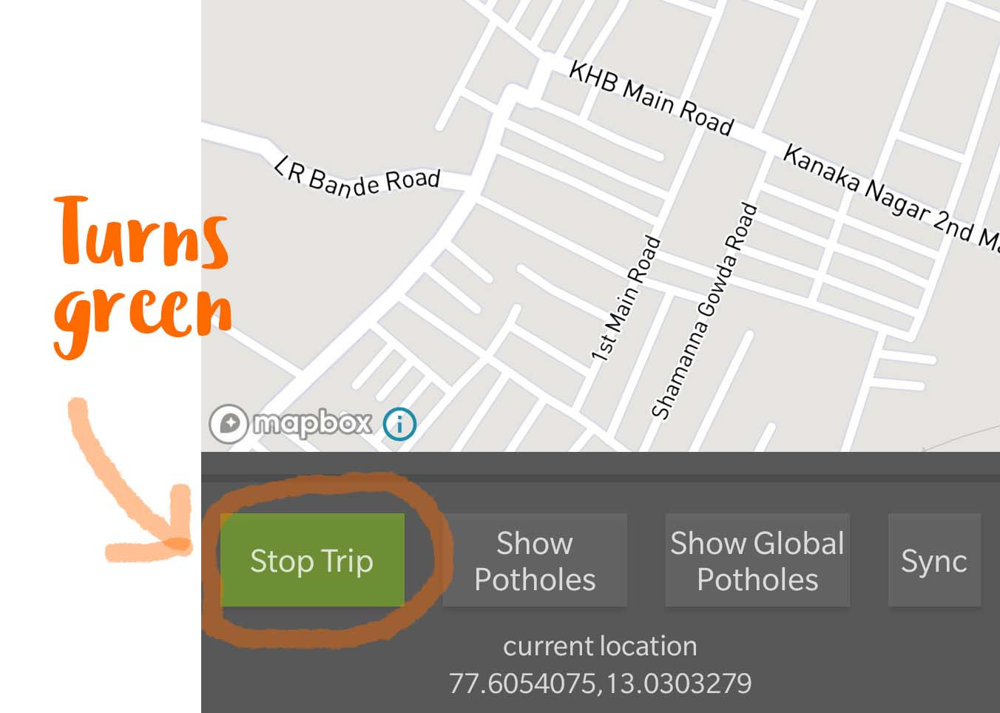
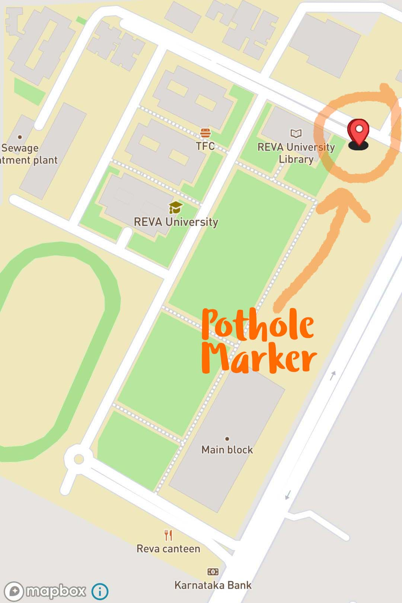

# Android applicaton for detection of Potholes
### created by Vijay Krishnan

This application will help you to determine the presence of Potholes on a road. The idea is to build an
application for android smartphones which are pre equipped with gyroscopic, accelerometer and GPS
sensors that can be programmed to detect real world physical changes made by the
smartphone device.

## How to use

* You will be prompted to login to a registered account during the first launch. If you happen to have already registered an     account     you can proceed by typing in the username and password respectively.
  

  

* If you haven't registered it yet, tap the 'Register' button, you will be shown a screen to create your account.
  

  

* Hurray!!, now that you have created an account and logged in, your screen might look something like this.
  

  

<b>Step 1:<b> 
Tap on the 'Start Trip' button (your button will turn green) and you are all set to begin your journey to discover pothole.

 
  
<b>Step 2:<b> 
Once you are done the tap 'End Trip' button. All the potholes has been detect will be stored locally on your device.

<b>Step 3:<b> 
* Tapping on 'Show Potholes' plots all the Pothole markers on the displayed map.
  

 
* You can contribute your coordinates to every other users by hitting the 'Sync' button.
* This will synchronize your locally stored coordinates to every other users, other users can view your data by tapping 'Show Global         Potholes'.
  
  <h4>This idea can be extended to detect humps and other irregularities on roads.</h4>
